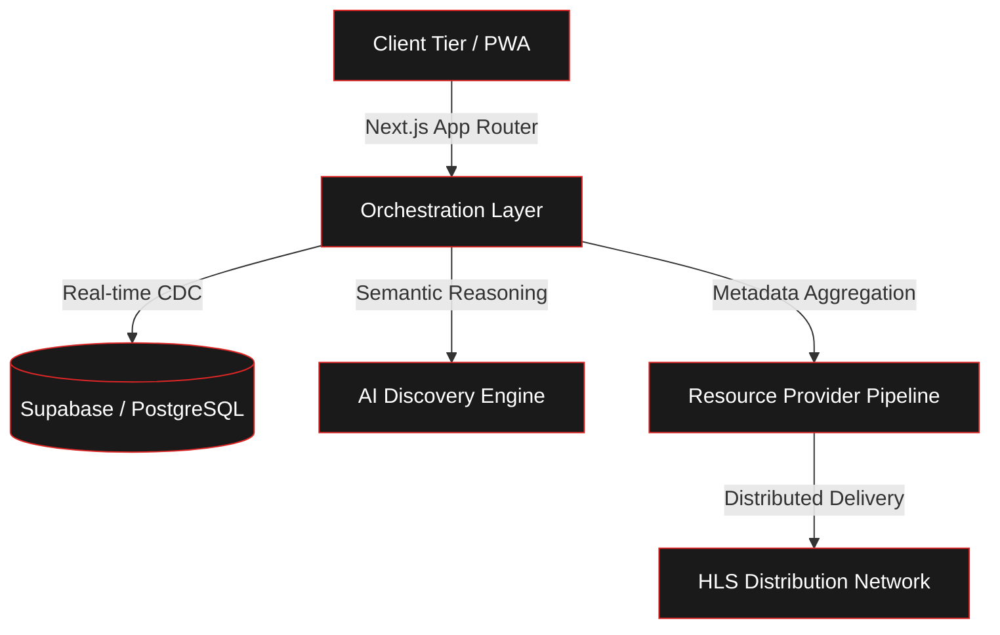

<!-- Animated Header with Professional Waving Red Theme -->

 

<!-- Updated Logo using your GitHub Attachment Link -->

  

<!-- High-Visibility Red Theme Typing Animation -->

 

<!-- Tech Badges -->

  

**FAM Zone** is a premium media and sports dashboard. It acts as a unified hub for **real-time sports updates**, **complete movie & series info**, and **automated schedules**—all inside a fast, dark-themed interface.

<!-- Red Gradient Separator -->

 

## 📊 System Performance & Insights

  
  
  

 

> [!TIP]
> **Real-time Velocity:** The orchestration engine processes over 1,000 tactical data points per second during peak live events, ensuring sub-second UI synchronization across all connected clients.

 

## ⚡ Engineering Highlights

<table>
<tr>
<td width="50%" align="center">

### 🏟️ Real-time Data Engine

Sub-second score synchronization, live tactical analytics, and dynamic SVG formation mapping across 20+ global regions.

</td>
<td width="50%" align="center">

### 🎬 Universal Media Hub

Deep metadata for movies and series with fast delivery, cross-device sync, and smart playback resume.

</td>
</tr>
<tr>
<td width="50%" align="center">

### 🎌 Reactive Scheduling

GraphQL-synced airing calendars with automated progress velocity tracking and multi-provider ID resolution.

</td>
<td width="50%" align="center">

### 🔍 Omnisearch Indexing

Fuzzy-matching search architecture (<kbd>⌘ K</kbd>) providing instantaneous results across unified distributed data sources.

</td>
</tr>
<tr>
<td width="50%" align="center">

### 🤖 LLM Discovery Agent

Personalized discovery engine utilizing Google Gemini for semantic context analysis and structured JSON status reporting.

</td>
<td width="50%" align="center">

### 📱 Responsive PWA

Installable Progressive Web App featuring orientation locking, hardware-accelerated UI, and secure cloud synchronization.

</td>
</tr>
</table>

<!-- Red Gradient Separator -->

 

## 🚀 Architectural Modules

<b>⚽ Sports Intelligence Pipeline</b> — Click to expand

 

| Feature | Description |
|:--------|:------------|
| 🔴 **Live Updates** | Real-time score and event sync with smooth UI updates |
| 📡 **Smart Routing** | Fast data fetching with automatic backup sources |
| 📊 **Pro Analytics** | Match stats, tactical heatmaps, and live event timelines |
| 👥 **Visual Tactics** | Dynamic SVG maps showing real-time player positions |

<b>🎬 Asset Lifecycle Management</b> — Click to expand

 

| Feature | Description |
|:--------|:------------|
| 🎞️ **Unified Search** | Complete movie and series info from top external databases |
| ▶️ **Fast Delivery** | High-quality video delivery with adaptive speed switching |
| ⏪ **Sync Everywhere** | Save your progress and resume on any device instantly |
| 📋 **Personal Library** | Organize your collection (Watching, Planned, Completed) |

<b>🤖 AI-Augmented Intelligence</b> — Click to expand

 

| Technical Feature | Implementation Detail |
|:--------|:------------|
| 🔍 **Semantic Discovery** | Context-aware recommendations based on historical library distribution |
| 📊 **Generative Reporting** | Structured analysis of user activity velocity and completion trends |
| 🧠 **Multi-Model Routing** | Token-efficient orchestration between Gemini Flash and Lite models |
| 🔔 **Predictive Airing Alerts** | Automated identification of high-relevance scheduling events |

<b>🛠️ Core Infrastructure</b> — Click to expand

 

| Technical Feature | Implementation Detail |
|:--------|:------------|
| 🔍 **Unified Search Index** | Low-latency global indexing across disparate media categories |
| 📜 **Sync Engine** | Real-time Supabase CDC (Change Data Capture) for multi-device parity |
| 🛡️ **Network Isolation** | Custom Server-Side Image Proxying to resolve CORS/Referrer policies |
| 🌙 **Design System** | Tailored dark-premium UI with strict design token adherence |

<!-- Red Gradient Separator -->

 

## 🧰 Tech Stack

 

<!-- Tech Icons Row -->
&nbsp;&nbsp;
&nbsp;&nbsp;
&nbsp;&nbsp;
&nbsp;&nbsp;
&nbsp;&nbsp;
&nbsp;&nbsp;
&nbsp;&nbsp;
&nbsp;&nbsp;
&nbsp;&nbsp;

  

| Layer | Technology | Description |
|:------|:-----------|:------------|
| **Core Framework** | [Next.js 14](https://nextjs.org/) | App Router with React Server Components |
| **Language** | [TypeScript 5.3](https://www.typescriptlang.org/) | End-to-end type safety |
| **Backend / DB** | [Supabase](https://supabase.com/) | PostgreSQL with Realtime CDC |
| **Caching Layer** | [Redis](https://redis.io/) | High-performance distributed caching |
| **Data Query** | [GraphQL](https://graphql.org/) | Efficient, typed API orchestration |
| **AI Intelligence** | [Google Gemini](https://ai.google.dev/) | Structured JSON reasoning and semantic discovery |
| **Asset Delivery** | [Video.js 8](https://videojs.com/) + [HLS.js](https://github.com/video-dev/hls.js/) | Industry-standard adaptive delivery |
| **State Middleware** | [Zustand](https://github.com/pmndrs/zustand) | Global state with persistent synchronization |
| **UI Notifications** | [Sonner](https://sonner.emilkowal.dev/) | High-performance toast notification system |
| **Performance** | [LRU-Cache](https://github.com/isaacs/node-lru-cache) | Edge Function optimization & asset buffering |

<!-- Red Gradient Separator -->

 

## 🏗️ System Architecture

 

<!-- Red Gradient Separator -->

 

## 🌍 Global Data Coverage

 

| 🇪🇺 European Data | 🌎 Americas Data | 🗺️ International | 🏆 Continental Cups |
|:---:|:---:|:---:|:---:|
| UK Regional Data | MLS Federation | World Cup Stats | UCL Analytics |
| Spain National | Brazil First Div | Olympic Tracking | UEL Analytics |
| Germany / France | Argentina / Mexico | AFC / CAF Events | UECL Analytics |

<!-- Red Gradient Separator -->

 

## 🔐 Security & Optimization

FAM Zone is engineered with a focus on network security and frontend performance:

> 🛡️ **HSTS** — Strict Transport Security for encrypted connections
>
> 🛡️ **X-Frame-Options** — Anti-clickjacking protection for the playback interface
>
> 🛡️ **CORS Mitigation** — Custom server-side proxying for sensitive asset retrieval
>
> 🛡️ **Referrer-Policy** — Privacy-centric origin handling
>
> 🛡️ **Asset Caching** — Optimized ISR strategies for high-traffic metadata routes

 

## 📄 License & Development

This repository is a private development focused on Next.js performance patterns and real-time data orchestration.

 

<!-- GitHub Stats & Streak (Red Themed / Neutral Background) -->

  
  

  

<!-- Red Gradient Footer Wave (Matching Top) -->

**Developed with ❤️ by [Timeswantstocode](https://github.com/Timeswantstocode)**

*A Universal Media & Sports Dashboard.*

*FAM Zone — Your hub for real-time sports and media info.*

